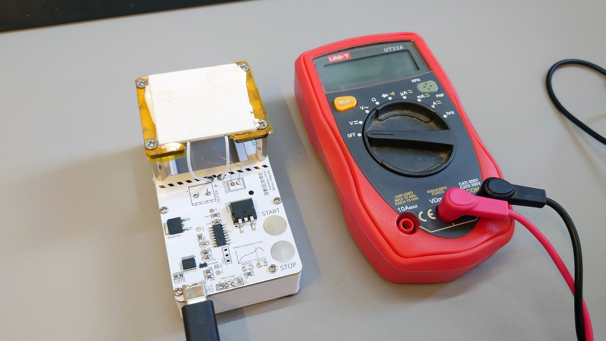
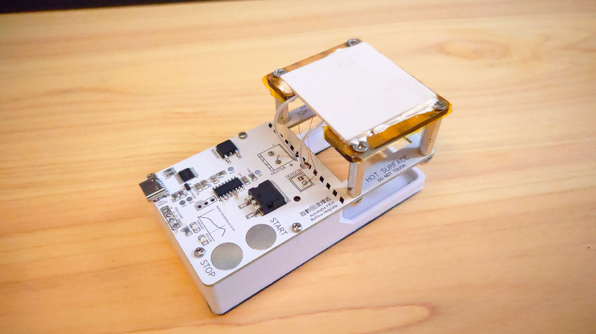
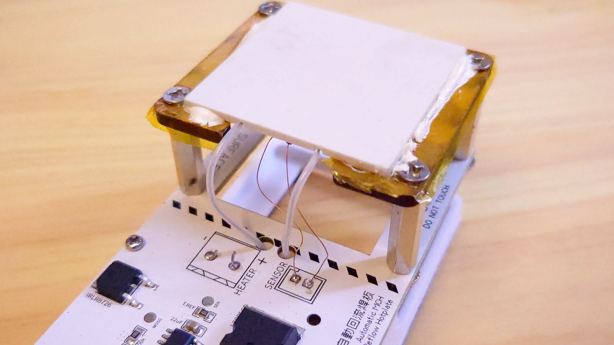
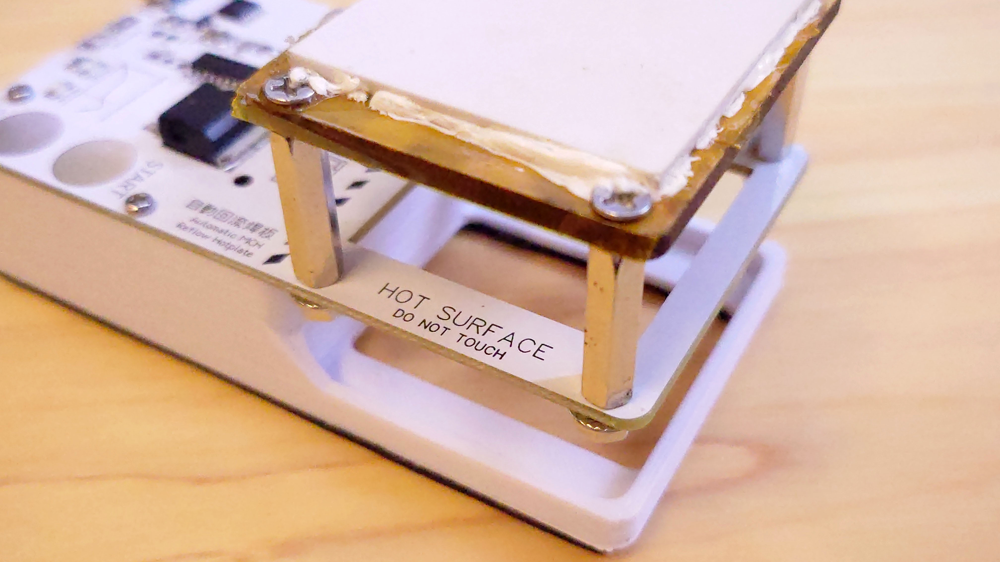
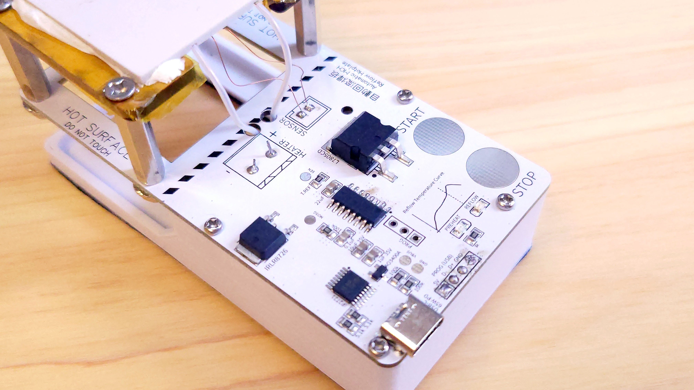

# MCH PD Powered Reflow Hotplate

A palm sized MCH (Metal Ceramic Heater) based reflow hotplate powered by USB-PD      

This is a DIY, low cost PD powered reflow hotplate that uses metal ceramic heater (MCH) instead of PCB hot plate for heating. It features a USB type C input port that can be powered by a 60W (65W) PD power supply at 20V 3A. This hotplate can automatically reflow mid-temperature range solder paste like Sn63Pb37. What you need is press and hold  the START button for 5 seconds and wait for the reflow process to finish.

### Features

- USB type C PD Powered (no special power adapter or dangerous AC power required)
- Budget & High quality heating element (instead of PCB hotplate)
- Open Source
- Fully automatic, just hold and press "START" and wait for the reflow to complete

## Quick Start

1. Power up your reflow hotplate with 60W or above PD charger (PD power bank works as well)
2. After the MCU boots up, the yellow LED should blink slowly, indicating it is ready
3. Place your PCB to be reflow on top of the white MCH module
4. Press and hold the START touch button until the yellow LED start fast blinking
5. Wait until the hotplate automatically complete the reflow process.  After the reflow is done, you will see the red light blinking slowly.
6. Carefully remove the completed PCB away from the MCH module. Press  STOP to reset the hotplate and it is ready for the next reflow cycle.

### Reflow Stages

| Stages | LED Status           | Meaning                                  |
| ------ | -------------------- | ---------------------------------------- |
| 1      | Yellow Slow Blinking | System Ready                             |
| 2      | Yellow Fast Blinking | Automatic Reflow starting in 5 seconds   |
| 3      | Yellow ON            | Heating to soaking temperature (<150 °C) |
| 4      | Red Fast Blinking    | Soaking (150 - 180 °C)                   |
| 5      | Red ON               | Reflowing (220 °C)                       |
| 6      | Red Slow Blinking    | Reflow completed. Remove PCB now         |

After stage 6 is completed and you have removed the PCB from the  hotplate, press STOP once to reset the stage to 1. You can also press  STOP anytime you think it is suitable, including early stopping if your  PCB is small and do not require that much temperature in the reflow  stage.

## Specifications

| properties                          | Value                                                        |
| ----------------------------------- | ------------------------------------------------------------ |
| Controller                          | CH552G (Arduino Programmable)                                |
| LEDs                                | Yellow(Preheat / Soaking), Red(Reflow)                       |
| Dimension (Without Base, W x L x H) | 54mm * 102mm * 30mm                                          |
| Dimension (Assembled, W x L x H)    | 54mm * 102mm * 48mm                                          |
| Heat-plate Size                     | 40mm * 40mm (± 1mm)                                          |
| Require External Programmer         | No (USB programming pins exposed as 2.54 pads)               |
| Power Input                         | USB type-C PD 20V 3A (60W / 65W PD power supply recommended) |
| Power Consumption                   | 30 - 50W (Depends on reflow stage)                           |
| USB Connector                       | USB type C                                                   |
| Solder Paste                        | Sn63Pb37 (Reflow profile editable in source code w/ Arduino IDE) |

## Gallery 
### v2 Hotplates (Original)

### v6/7 Hotplates

See more over [here](https://github.com/tobychui/MCH-PD-Automatic-Reflow-Hotplate/wiki/Introduction-to-the-v6-Hotplate!)

## Programming

### Programming Interface

1. The PCB contains a 2.54x4 pins labeled PROG (USB) with 5V, D+, D- and GND. This is a standard USB 2.0 connector as CH552G has build in USB hosts mode that do not require a USB to UART converter chip. Solder a USB male header at this location following the pins label written on the silkscreen.

2. There are another 2.54 x 3 pins also labeled PROG on the left 2 pins of the 3 pins. It is for forcing the CH552G into USB programming mode. If you want to re-program the reflow hotplate, bridge the two left most pins (the two pins closer to the LED) of the 2.54x3 and connect the USB pins to your computer. Otherwise, you can bridge the right-2 pins or leave all 3 pins unconnected.

### Flashing (Downloading) New Firmware

The timing for downloading the firmware are critical to the success of firmware download. Please follow EXACTLY on how to flash the firmware with the steps below.

#### Serial Mode

1. After you have finish changing the code in the firmware, select "16Mhz (internal, 3.3V or 5V)" in the "Clock Source" menu. For upload method, select "Serial"
2. Insert the hotplate's USB port into your computer. A new COM port should pops up. Select that newly pop-up COM port as download target
3. Click the Download button in your Arduino IDE

#### USB Mode

In case the Serial mode is not working due to some driver conflict or Windows bug, you can optionally choose USB upload mode

1. After you have finish changing the code in the firmware, select "16Mhz (internal, 3.3V or 5V)" in the "Clock Source" menu. For upload method, select "USB"
2. Click the Download button in your Arduino IDE
3. At the same time of doing step 2, bridge the left-two PROG pins from the 2.54 x 3 header, and quickly insert the USB port into your computer's USB port (timing is important)
4. Just before the Arduino IDE starts to upload, un-bridge the left-two PROG pins from the 2.54 x 3 header. If you keep them bridged, the Arduino IDE will freeze during upload and after a few seconds report upload failed due to timeout.
5.  If timing is correct, you will see the Arduino debug console says upload completed
6. If you un-bridge it too early, you will see a new COM device pops up. You will need to unplug the device, short the left-two PROG pins again and repeat step 3 - 4.

### Notes

- If you encounter issues with yellow LED not light up when powered up / unstable touch buttons / lower than expected peak reflow temperature,  please make sure you are using a high quality PD power supply and cables that is designed for 60W or above.

- The reflow temperature is intentionally set higher than the expected  temperature of 230 degree celcius to make up for the lose in heat to the surrounding. You can perform early-stopping if the reflow is completed  but the hotplate is still heating up.

## License

CC BY-NC-SA
